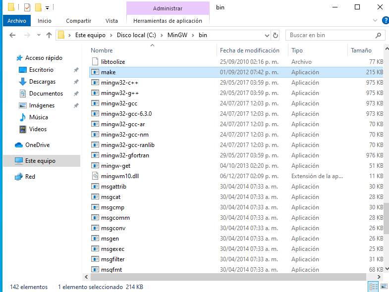

# CH552 - Guía de Uso con SDCC

Este repositorio proporciona información y herramientas para el desarrollo de software embebido utilizando el microcontrolador CH552. Dado su tamaño compacto y bajo costo, el CH552 es una excelente opción para proyectos embebidos.

## Instalación del Compilador para CH552

Siga los pasos a continuación para instalar las herramientas necesarias:

### 1. Instalación de Git para Windows

Descargue e instale Git para Windows desde [el sitio oficial de Git](https://git-scm.com/download/win).

### 2. Instalación de SDCC

Descargue e instale SDCC versión actualizada. Puede encontrar la última versión en [la página de descargas de SDCC](https://sourceforge.net/projects/sdcc/files/sdcc/3.6.0/).

### 3. Instalación de MinGW

Instale MinGW, que es un conjunto de herramientas para el desarrollo de software en Windows. Puede descargar el instalador desde [el sitio oficial de MinGW](https://sourceforge.net/projects/mingw/).

### 4. Instalación de WCHPTOOL

[WCHPTOOL](https://www.wch-ic.com/downloads/WCHISPTool_Setup_exe.html) es una herramienta utilizada para la programación del CH552. Asegúrese de instalarlo correctamente.


## Configura MAKE

Recordar que para sistemas operativos  Windows es necesario agregar un paso extra y es abrir el entorno de variable -> Editar variable de entorno

```
C:\MinGW\bin
```

Busca el archivo 
```
C:\MinGW\bin\mingw32-make
```


renombralo
```
C:\MinGW\bin\make
```



editar y cambiar el nombre del archivo 
## Pasos Generales

Una vez que haya instalado todas las herramientas necesarias, puede seguir estos pasos generales:

1. Clone este repositorio en su máquina local usando el siguiente comando:

    ```bash
    git clone https://github.com/Cesarbautista10/CH552-Entorno-Windows.git
    ```

2. Abra el directorio del repositorio:

    ```bash
    cd CH552-Entorno-Windows
    ```

3. Desarrolle su software embebido utilizando el CH552.

Esperamos que esta guía le ayude a comenzar con el desarrollo de software embebido utilizando el microcontrolador CH552. ¡Buena suerte!
